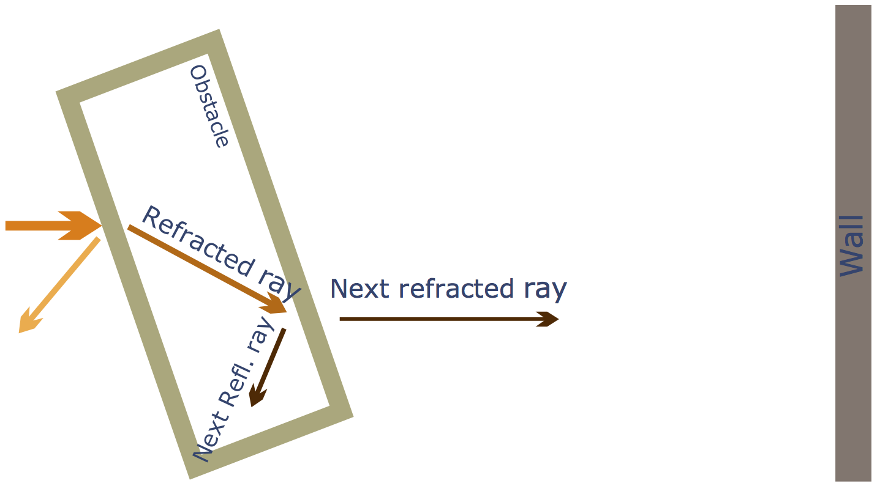
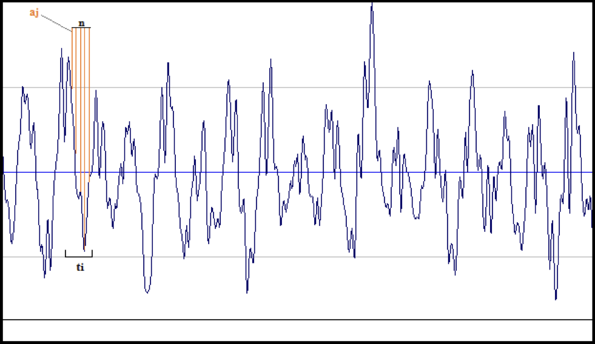
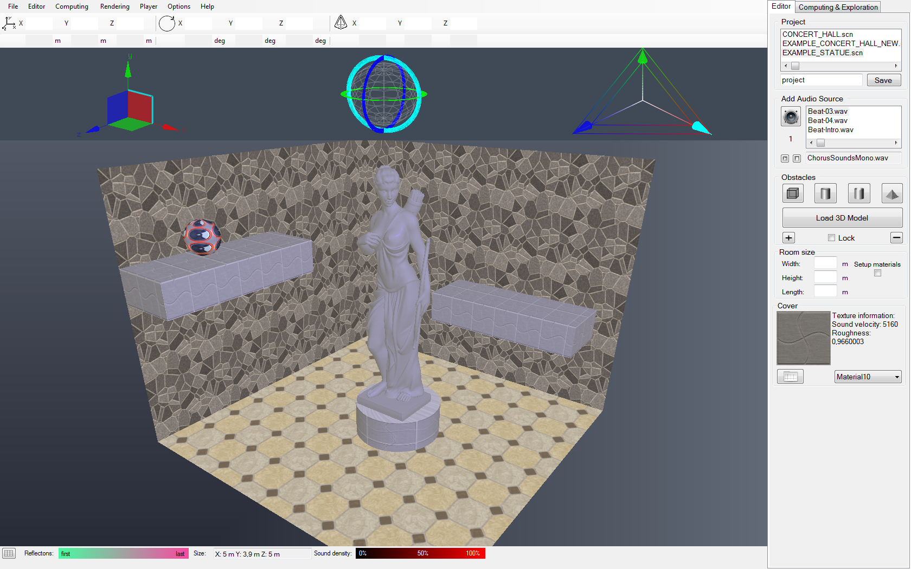

# Intel ISEF 2011

| | |
| --- | --- |
| **Project** | Sound Wave Propagation: 3D Premises Model |
| **Authors** | [@galarius](https://github.com/Galarius), [@zurk](https://github.com/zurk) |
|**Organization**|Lyceum of Information Technologies, 1533|
| **Section** | Computer Science |
| **Awards**  | *Intel ISEF Grand Award (2011, 4th place worldwide),  Special Award (2011, Acoustic Society of America certificate)  Los Angeles, California, USA*

Given software toolkit provides sound wave propagation modeling. Key features include calculation and dynamic visualization of sound density map and audition at any chosen location. The application is designed for acoustic exploration of concert halls, recording studios, home theaters, etc without using expensive lab equipment. It can be used for movies and games sound engineering and design.

The mathematical model is based on various acoustic properties of the environment as well as fundamental physical laws: reflection, refraction, interference. Also it allows implementing diffraction. 

The effects of sound wave behavior in the premises featuring complex geometry and obstacles are considered in detail. Digital sound processing methods are used in order to obtain the appropriate frequency spectrum characteristics.

Sound density computing model is based on ray tracing method. Dynamic visualization of the sound density map is obtained using volume rendering technique. 

In order to achieve the appropriate flexibility and performance several development tools were applied. Project modules were developed in Microsoft Visual Studio C#. OpenGL is used for visualizing. The audio player was implemented with DirectSound library (audio stream is synchronized with dynamic visualization of the sound density map). OpenCL framework for parallel computing is also used.

*Programming: `OpenGL`, `OpenCL`, `C#`, `Direct Sound`*

*Aids: `iZotope RX`, `Sony Sound Forge`*

[Journey Description (Git Book)](https://galarius.gitbooks.io/intel-isef-2011)

---

## Table of content

- [Project goals](#project-goals)
- [Project structure](#project-structure)
- [Basics of physical model](#basics-of-physical-model)
- [Physics in progress](#physics-in-progress)
- [Delay](#delay)
- [Single-band equalizer](#single-band-equalizer)
- [Sound density. RMS](#sound-density-rms)
- [Project evolution](#project-evolution)
- [Outcomes](#outcomes)
- [ISEF 2011](#isef-2011)
- [Publication](#publication)
- [Screenshots](#screenshots)
- [License](#license)

## Project goals

* Premises design:
    * Walls
    * Objects and 3D models 
    * Sound sources

* Physics processing:
    * Waves propagation
    * Sound render

* Acoustic exploration:
    * Sound density dynamic visualization
    * Audition of processed phonograms

## Project structure

The toolkit is divided into 4 parts:

1. `3D room editor` - allows to virtually design different types of rooms, install sound sources, set the acoustic parameters of the premises.

2. `Physics` module calculating the wave profile (list of modifiers) for given premise.

3. `Digital sound processing` - on this stage a modified sound wave is calculated based on the source wave and the wave profile.
 
4. `Acoustic exploration tool` uses all the calculated data and includes dynamic sound density map visualization, audition at any chosen location synchronized with dynamic sound density map, wave profile visualization

Such separated architecture makes the system more flexible and expandable.

## Basics of physical model

The key task was to develop a physical model for sound propagation in premise. It takes into account most significant acoustic effects such as sound reflection, diffuse reflection, refraction and interference.

An original grid-based wave tracing algorithm was developed for this project. 

## Physics in progress

The sound propagates along so called tracing rays that radiate from the source.

|||
|-|-|
|Considering every tracing ray separately…|We find obstacle from which a tracing ray is reflected.|
||
|We build a new, reflected ray|A refracted ray is also built. Now we have two new rays that will be processed in the same way. i.e. our method is recursive.|
|||
|Recursion continues until energy of the wave falls beyond given value.|The whole picture.|
|||
|After all wave paths are calculated the premise is covered with a grid which has a sound receiver in each node.|Processing each wave path separately, we store wave parameters into nearest sound receivers. The wave parameters are the following: accumulated propagation delay and the energy. The energy decrease during reflections and propagation is also taken into account in our model.|
|||
|We repeat the same procedure for each wave.|As a result we get so called wave profile mentioned before. A wave profile is a set of wave parameters for each sound source. You can see it on this picture (wave parameters are represented by color circles). After the physical calculations are performed, the wave profile is passed into DSP module.|

## Delay

Different paths of the waves pass reflecting from various obstacles result in different times they reach the receiver. This effect and phase changing modulate using delay.

## Single-band equalizer

After the reflection or refraction of sound, sound wave may be distorted, losing part of the energy at certain frequencies. This effect can be modeled using multiple bandpass filters. Therefore, to distort the sound according to its propagation and reflection in premise, we use parametric equalizer containing of 7 bandpass filters on different frequencies.

## Sound density. RMS

The sound density is calculated for each given point of the premise at each time of sound wave propagation using the formula of the mean square.

Root Mean Square (RMS)

## Project evolution

There were three versions of the project. On every stage the model and functionality were improved.
Various tests and research work was performed during development process.

1. We studied sound propagation laws, tested the calculation speed, tried different mathematical and physical approaches.

2. We implemented new features and improved the model: FFT was replaced with bandpass filters, 3D sound density map and ‘ball model’ illustrating sound propagation paths were implemented. Diffuse reflections were included into version 3 physical model.

3. System architecture was rearranged and the user interface was improved.

## Outcomes

* This toolkit designed for premises acoustic research and optimization

* Optimal parameters for concert halls, audition rooms and music clubs can be calculated

* This tool can be used in living interior acoustic design

* This system can be used in game development and movie industry

* There is no need to use expensive equipment to perform experiments

## ISEF 2011

This project was awarded Fourth Place in Computer Science at International Science and Engineering Fair at 2011 in Los Angeles.

## Publication

The detailed report about ISEF 2011 journey could be found at GitBook: https://galarius.gitbooks.io/intel-isef-2011 (In Russian)

## Screenshots

|  |  |
| --- | --- |
| Designing premise using editor | Wave propagation modelling |
|  |  |
| Wave propagation with reflections | Wave paths |
|  |  |
| Sound density modelling | More complex premise |

## License

---

 <a rel="license" href="http://creativecommons.org/licenses/by-nc-nd/4.0/">
